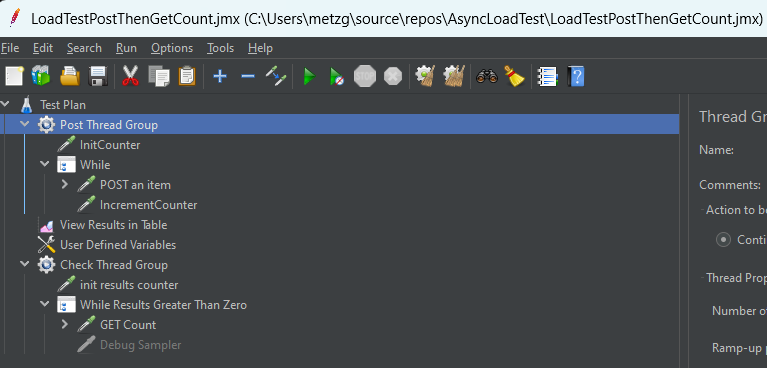
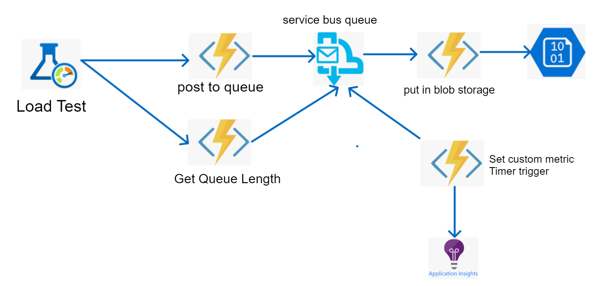
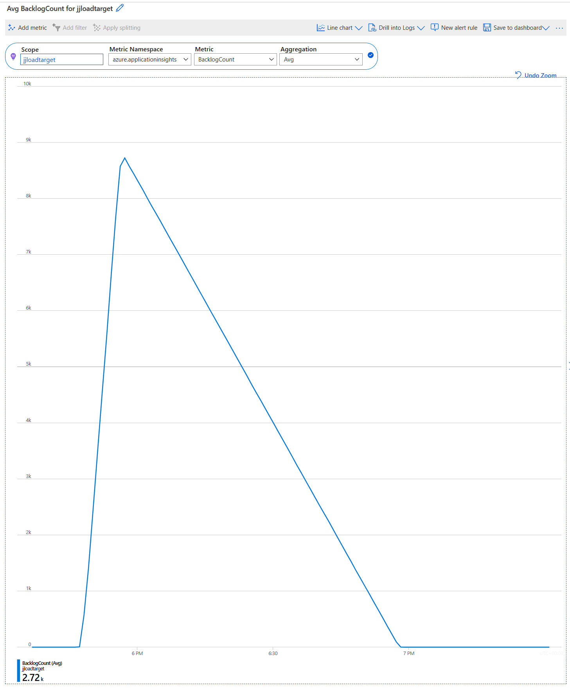
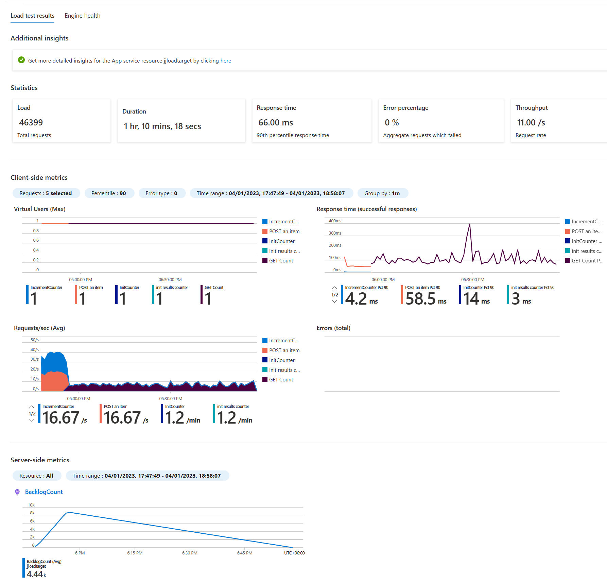

# Load Testing background services

## Do I need to load test anyway?

Like many developers, I have followed or attempted to follow best practices and patterns when building APIs and services. Then when it comes to deployment, I deploy my API to my favorite infrastructure on Azure, picked an appropriate SKU and left it there. The use of load testing tools was seen something someone else could do or something a little too specialist for me or complicated for me. But there was always this niggling feeling that what I had built may not perform well enough. 

Load testing is a vital step in the lifecycle of a service - for a team to *know* that their service can take the load required of it. 

## Azure Load Test to the rescue

With the advent of Azure Load Testing, almost all of the infrastructural challenges of building load tests have been removed. You just have to be able to write or adapt JMeter JMX files and upload them into a load test. I recommend looking at this [tutorial](https://learn.microsoft.com/en-us/azure/load-testing/tutorial-identify-bottlenecks-azure-portal) for how to use Azure load testing against a web app.

## What is special about background processes?

The use of load testing means it is now quite straightforward to test web apps and APIs, but it is less clear how to effectively load test and monitor a background or asynchronous service and to know when all of the background processing has completed and also that all requests have been processed correctly.

This repository contains an Azure Load Testing sample that tests and monitors an asynchronous service. This is supplied with a sample application against which the load test can be run. This sample application comprises some APIs which push messages to a queue and then later processes these messages from the queue.

## How does the load test solve these problems?

This test:
1. Sends a fixed number of POST requests to an API
2. Uses a second phase of the load test to then poll another API to see how many items remain to be processed. Only when there are none, does the test complete.
3. Uses a custom metric in application insights to represent this queue length.

In this way, the load test executes for as long as it takes to process all of the data and the load test can then pull in the custom metric to graph the items remaining to be processed into the load test results. Thus giving the tester a more complete picture of how long an asynchronous process takes to complete a given number of requests.

## Load Test Structure

All JMeter load test use the notion of thread groups. There are blocks of requests to be sent. More standard load tests start low and ramp up to a limit and continue for a given period of time. The thread groups in this test are *while loops* and can send a fixed number of requests or can keep sending requests until a condition is met. This is useful as the use of these while loops can firstly send a fixed number of requests and secondly run the test until the background *queue* of requests is empty.

This load test has 2 thread groups:
1. the one that generates the API post calls. This one is designed to send a fixed number of HTTP POST requests. The number is parameterised and can be injected into the test at runtime. This thread group is the minimum needed.
2. The second thread group is designed to poll the state of the number of pending items to complete and in the test application, queries the service bus queue length - but it's HTTP GET request could query something else, such as a database. This thread group is designed to run after the first thread group (this is not the default JMeter behaviour) and is designed to allow the test to keep running until all requests are processed. That way, the length of the test is the total time to process all messages.

A simpler arrangement could be to just use a single thread group and to let the test complete once all requests are sent. But you would then have to separately look at the metrics of the system under test to establish when the service has completely finished processing. But, the 2 thread groups give a more complete picture.

To allow the load test to get a more complete picture of the remaining items to be processed, the system under test regularly polls the remaining item count and generates a [custom metric](https://learn.microsoft.com/en-us/azure/azure-monitor/essentials/metrics-custom-overview) - this metric can then be pulled into the load test run.

## Demonstration System Under Test

The system under test comprises 4 Azure functions:
1. An HTTP triggered function (web API) that takes a message from the HTTP body (POST) and then pushes this into a service bus queue. This is the load generator for background processing.
2. A service bus queue triggered function that does some processing on the message received and then copies this to Azure blob storage. This is a message processor and the one supplied has been designed to be slow to simulate a some complex background processing. As a side effect, the count of the messages in the blob storage may also be used to verify processing completeness.
3. An HTTP triggered function (web API) that returns a count of the number of messages in the service bus queue. This API is used by the second phase of the load test to poll the number of items in the service bus queue. The load test looks for zero items to complete the execution of the load test.
4. A timer triggered function that continuously checks the number of items in the service bus queue (every 15 seconds by default). It then sets this as a value in an Application Insights custom metric. This continuously triggered function is responsible for providing the metric that the load test can pull from application insights to give the "burn-down chart" for the test.

All of the above functions are built into a single function app for a single deployment. These have a number of application settings that are discussed in a later setting. 

To be clear, this is a demonstration application, but it allows you to test the load test before using it on a real target service. But elements of this could be added to an existing service to support this form of testing.

## Custom metric

## Load Test Sample Run

## Function App Configuration Items needed

1. ServiceBusConnection - the connection string to Azure service bus instance
2. QueueName - service bus queue name
3. MetricName - the name of the application insights (configured for the function app) metric
4. outboundContainer - the name of the blob storage container in which the messages get put after pulling from the service bus queue
5. TargetStorageAccount" - the connection string for the above storage account
6. WaitMs - how many mS to wait in each letter of string copy (to simulate busyness)
7. metricUpdatePattern - CRON pattern for the timed function that sets the metric value from the queue length ("*/15 * * * * *" is every 15 seconds)

It may also be useful (for test purposes) to limit the scale out of the function as service bus is used by the function runtime to scale out to multiple instances - thus getting more work done in parallel. This is what is needed for a real workload, but for this demonstration, limiting the function to a few instances (in the scale out section) is useful to be more representative of a background processing activity.
